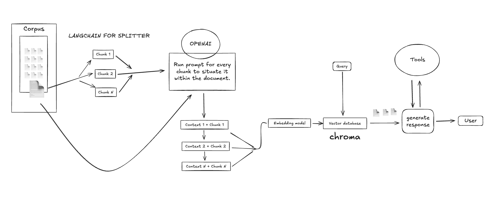
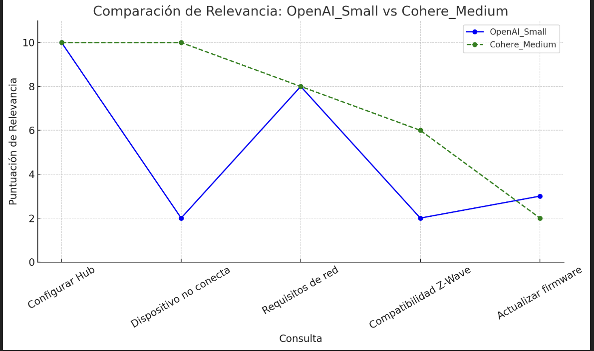
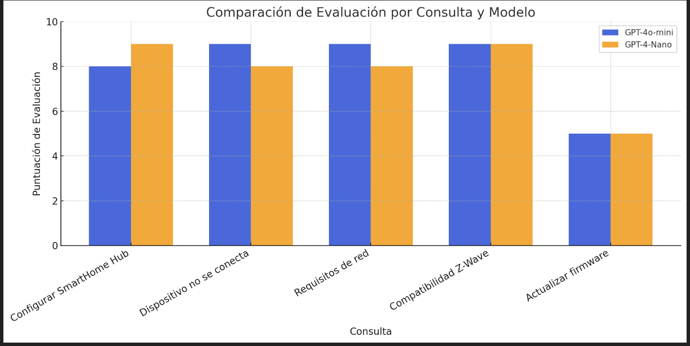

# 🚀 Tech Support Assistant (NestJS)

> Asistente de soporte técnico potenciado por IA. Integra modelos de lenguaje (LLM), embeddings y evaluación de respuestas.

---

## 📁 Estructura del Proyecto

```bash
tech-support-assistant/

├── src/                        # Código fuente principal
│   ├── main.ts                 # Punto de entrada
│   ├── app.module.ts           # Módulo raíz
│   ├── app.controller.ts       # Controlador principal
│   ├── app.service.ts          # Servicio principal
│   ├── modules/                # Módulos funcionales
│   │   ├── llm/                # Modelos de lenguaje
│   │   ├── agent/              # Agentes conversacionales
│   │   ├── embeddings/         # Embeddings y vectores
│   │   ├── tools/              # Herramientas auxiliares
│   │          
│   └── utils/                  # Utilidades generales
    └── evaluation/             # Evaluación de modelos y resultados      
├── data/                       # Datos y documentación técnica
│   ├── tickets.json            # Tickets de soporte de ejemplo
│   ├── service-status.json     # Estado de servicios para simulaciones
│   └── docs/                   # Documentación técnica del producto
│       ├── faq.md
│       ├── technical_specifications.md
│       ├── troubleshooting_guide.md
│       ├── configuration_manual.md
│       └── installation_guide.md
├── test/                       # Pruebas unitarias e integración
├── .env                        # Variables de entorno
├── .env.example                # Ejemplo de variables de entorno
├── README.md                   # Documentación principal
├── package.json                # Dependencias y scripts npm
├── nest-cli.json               # Configuración de NestJS CLI
├── tsconfig.json               # Configuración TypeScript
├── eslint.config.mjs           # Configuración ESLint
└── .prettierrc                 # Configuración Prettier
```

---

## 📸 Arquitectura General

Para comprender la organización del sistema y la interacción entre módulos, consulta el siguiente diagrama:



---

## 🔍 Técnica de Fragmentación y Recuperación de Contexto

Para mejorar la precisión en las respuestas, implementamos un **Context Retriever** mediante fragmentación (chunking) de documentos:

1. Dividimos los documentos en fragmentos (chunks) de texto.
2. Cada chunk se procesa con un LLM para extraer contexto relevante.
3. Generamos y almacenamos embeddings de los chunks en ChromaDB para recuperación semántica.
4. Al atender una consulta, recuperamos los chunks más relevantes y los presentamos al LLM como contexto adicional.

---

## 🛠️ Tecnologías Principales

- **NestJS**: Framework backend modular.
- **LangChain**: Fragmentación de texto y orquestación de cadenas.
- **ChromaDB**: Almacenamiento y recuperación de vectores semánticos.
- **OpenAI API**: Generación de embeddings y razonamiento LLM.
- **TypeScript**, **ESLint**, **Prettier**, **Jest**: Calidad de código, estilo y pruebas.

---

## 📊 Evaluación de Modelos y Embeddings

Realizamos pruebas para medir el rendimiento y precisión de diferentes configuraciones:

- **Embeddings**: Comparativa entre `OpenAI_Small` (1536 dimensiones) y `Cohere_Medium` (768 dimensiones).

  

- **Respuestas LLM**: Evaluación de precisión de agentes conversacionales.

  

Puedes ejecutar los scripts de evaluación con:

```bash
npx ts-node src/evaluation/scripts/evaluate-embeddings.ts
npx ts-node src/evaluation/scripts/evaluate-llm-responses.ts
```

## 🔧 Configuración de Variables de Entorno

Antes de ejecutar el proyecto, copia el archivo `.env.example` a `.env` y completa las variables de entorno:

```env
OPENAI_API_KEY="tu_openai_api_key"
COHERE_API_KEY="tu_cohere_api_key"
URL_DOCS=http://localhost:8080
```

## ⏳ Primer Arranque y Embeddings

Al iniciar la aplicación con:

```bash
npm run start:dev
```

esspera a que termine el proceso de generación de embeddings de todos los documentos. Verás logs similares a:

```text
[Nest] 51030 - 05/22/2025, 2:21:27 AM LOG [DocumentLoaderService] Documents loaded successfully
Servicio de vectores inicializado correctamente
[Nest] 51030 - 05/22/2025, 2:21:27 AM LOG [NestApplication] Nest application successfully started +2ms
Aplicación disponible en: http://localhost:8080
```

Solo una vez completado este paso podrás interactuar con el endpoint `/chat`.

## 🚀 Prueba del Agente Conversacional

Para probar el agente, envía un **POST** a la siguiente ruta:

`http://localhost:8080/chat`

Con el siguiente payload en formato JSON:

```json
{
  "message": "hola",
  "conversationId": "1"
}
```

Por ejemplo, usando **curl**:

```bash
curl -X POST http://localhost:8080/chat \
  -H "Content-Type: application/json" \
  -d '{"message":"hola","conversationId":"1"}'
```

---

## 🗂️ Datos y Documentación Técnica

En la carpeta `data/` se incluye información de ejemplo y documentación del producto:

- **tickets.json**: Tickets de soporte simulados.
- **service-status.json**: Estados de servicios para pruebas.
- **docs/**: Documentación técnica en formato Markdown:
  - `faq.md`: Preguntas frecuentes.
  - `technical_specifications.md`: Especificaciones técnicas.
  - `troubleshooting_guide.md`: Guía de resolución de problemas.
  - `configuration_manual.md`: Manual de configuración.
  - `installation_guide.md`: Guía de instalación.

---

## ⚙️ Instalación y Ejecución

1. Clona el repositorio:
```bash
git clone <https://github.com/joseandrescolmenares/challenge.git>
cd tech-support-assistant
```  
2. Instala las dependencias:
```bash
npm install
```  
3. Ejecuta la aplicación en modo desarrollo:
```bash
npm run start:dev
```  
4. Inicia ChromaDB en otra terminal:
```bash
chroma run
```  
5. (Opcional) Corre evaluaciones:
```bash
npx ts-node src/evaluation/scripts/evaluate-embeddings.ts
npx ts-node src/evaluation/scripts/evaluate-llm-responses.ts
```

---

## 📝 Breve Informe de Diseño

### ¿Por qué elegimos estas tecnologías?

Bueno, principalmente utilizamos **LangChain** para hacer el splitter de texto, ya que nos brinda una función lista para usar que ahorra tiempo y líneas de código. Además, aprovechamos sus chains que se integran de forma muy sencilla con **ChromaDB**, facilitando la indexación y la recuperación semántica de los fragmentos.

Elegimos **ChromaDB** porque es una vector store open source, ligera y de fácil configuración. Para la generación de embeddings y el razonamiento LLM, confiamos en **OpenAI API**, ya que ofrece modelos robustos, bien documentados y en constante evolución.

Por último, implementamos scripts de evaluación para medir precisión y rendimiento, permitiéndonos iterar rápidamente y ajustar parámetros hasta encontrar el equilibrio óptimo entre velocidad y calidad de las respuestas.

## 💡 Mejora y Extensiones Futuras

En un chatbot de soporte, la creación indiscriminada de tickets puede saturar el sistema con casos similares. Para mitigar esto:

- Al recibir una solicitud de ticket, primero compara la descripción con tickets existentes usando un LLM.
- Si el ticket es **similar** a uno existente, añade al usuario a ese ticket en lugar de crear uno nuevo.
- Si no es similar, crea un nuevo ticket normalmente.

Para mejorar la precisión de la recuperación de información:

- Combina la búsqueda semántica (embeddings) con un índice de búsqueda tradicional (por ejemplo, TF-IDF).
- Fusiona los resultados de ambos índices y aplica un re-ranker para seleccionar los fragmentos (chunks) más relevantes.
